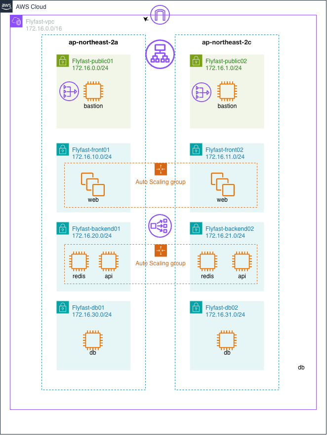

# 프로젝트 명세서

## Flyfast — 항공권 검색·예약 서비스

### 문서 정보

| 항목 | 내용 |
|---|---|
| 프로젝트명 | Flyfast — 항공권 검색 및 예약 플랫폼 |
| 팀원 | 안원주 · 김강현 · 조성민 |
| 개발 기간 | 2026.08.14 ~ 진행 중 |
| 문서 버전 | v1.3 (2026.08.18) |
| AWS 배포 | http://flyfast-web-alb-1629813771.ap-northeast-2.elb.amazonaws.com (별도 계정 `738815760058` 기준, 6.3절 참고) |
| 개발 환경 | React + Vite · FastAPI · MySQL 8 · Redis |

> **문서 역할 안내**: 이 문서는 팀 공식 프로젝트 명세서다. 우리 계정(`379937169195`)에서 실제로 진행 중인 인프라의 작업 로그/체크리스트는 `PROJECT_PLAN.md`를 참고한다 — 두 문서가 서로 다른 AWS 계정을 설명할 수 있으니 계정 번호를 항상 확인할 것.

---

## 1. 프로젝트 개요

### 1.1 배경 및 목적

항공권 검색 과정은 출발지·도착지·날짜·여행 인원 등 여러 조건을 한 번에 비교해야 하며, 서비스 운영 시에는 검색 트래픽과 예약 데이터를 안정적으로 분리해야 한다. Flyfast는 직관적인 항공편 탐색 UI와 AWS 멀티 AZ 인프라를 함께 구축하여, 확장 가능한 항공권 검색·예약 서비스의 기반을 구현하는 것을 목표로 한다.

### 1.2 프로젝트 목표

| 구분 | 목표 |
|---|---|
| 기능 목표 | 출·도착지, 날짜, 인원 입력 → 항공편 검색 → 직항 필터 → 항공편 선택 |
| 기술 목표 | React + Vite, FastAPI, MySQL 8, Redis 고정 · ORM 미사용 |
| 인프라 목표 | 2개 AZ, 8개 서브넷, 계층별 보안그룹, NAT 이중화, ALB 기반 웹 이중화 |
| 협업 목표 | Terraform 코드 기반 인프라 재현, Git 이력과 운영 인계 문서 유지 |

### 1.3 개발 범위

| 포함(In Scope) | 제외/후속(Out of Scope) |
|---|---|
| 항공권 검색 폼, 노선 교환, 날짜·인원 선택 | 실시간 항공사 운임 API 연동 |
| 직항 필터, 샘플 항공편 목록, 선택 상태 | 실제 결제·발권·환불 처리 (결제는 Mock 처리로 대체) |
| AWS VPC, EC2 10대, NAT 2대, ALB | 회원 인증 및 운영자 백오피스 |
| 반응형 웹·OG 이미지·배포 검증 | RDS/ElastiCache 관리형 서비스 전환 |

### 1.4 팀 구성 및 역할

| 이름 | 역할 | 주요 담당 |
|---|---|---|
| 안원주 | 팀장 / 인프라 | 요구사항 정리, Terraform, AWS 네트워크·배포, 통합 관리 |
| 김강현 | 백엔드 / 데이터 | 예약 도메인·API·DB 설계, 데이터 흐름 및 검증 |
| 조성민 | 프론트엔드 | 검색·항공편 UI, 반응형 스타일, 사용자 상호작용 |

---

## 2. 시스템 아키텍처

### 2.1 네트워크 구성 (Flyfast-vpc / 172.16.0.0/16)

<div class="diagram">



<p class="diagram-caption">[그림 1] Flyfast 인프라 구성도 — 2개 가용영역 × 4계층 서브넷, Web·Backend 계층은 Auto Scaling Group으로 이중화</p>

</div>

| 계층 | 서브넷 (2a / 2c) | 유형 | 배치 인스턴스 |
|---|---|---|---|
| 공개 | Flyfast-public01 / 02 | Public | bastion, NAT Gateway, ALB |
| 프론트 | Flyfast-front01 / 02 | Private | web-a, web-c |
| 애플리케이션 | Flyfast-backend01 / 02 | Private | api-a/c, redis-a/c |
| 데이터 | Flyfast-db01 / 02 | Private | mysql-a, mysql-c |

**설계 의도**: ap-northeast-2a와 2c에 동일 계층을 대칭 배치하고, AZ별 NAT Gateway와 라우팅 테이블을 분리했다. 한 AZ의 장애가 다른 AZ의 아웃바운드 경로와 웹 서비스에 영향을 주지 않도록 구성했다.

### 2.2 트래픽 흐름

<div class="diagram">

<svg viewBox="0 0 700 800" xmlns="http://www.w3.org/2000/svg" font-family="Helvetica, Arial, sans-serif">
  <defs>
    <marker id="arrow" viewBox="0 0 10 10" refX="8" refY="5" markerWidth="7" markerHeight="7" orient="auto-start-reverse">
      <path d="M 0 0 L 10 5 L 0 10 z" fill="#333"/>
    </marker>
    <marker id="arrowGray" viewBox="0 0 10 10" refX="8" refY="5" markerWidth="7" markerHeight="7" orient="auto-start-reverse">
      <path d="M 0 0 L 10 5 L 0 10 z" fill="#888"/>
    </marker>
  </defs>

  <!-- 사용자 브라우저 -->
  <rect x="245" y="14" width="210" height="46" rx="23" fill="#F4F6F8" stroke="#333" stroke-width="1.3"/>
  <text x="350" y="42" font-size="14" font-weight="bold" text-anchor="middle" fill="#222">사용자 브라우저</text>

  <line x1="350" y1="60" x2="350" y2="98" stroke="#333" stroke-width="1.6" marker-end="url(#arrow)"/>
  <text x="360" y="83" font-size="11" fill="#222">HTTP 80</text>

  <!-- Public group -->
  <rect x="90" y="100" width="520" height="120" rx="8" fill="#EAF6E3" stroke="#2E7D32" stroke-width="1.4"/>
  <text x="105" y="120" font-size="11.5" font-weight="bold" fill="#2E7D32">Flyfast-public01 / 02 · 172.16.0.0/24, 172.16.1.0/24 (Public)</text>

  <rect x="115" y="135" width="220" height="72" rx="6" fill="white" stroke="#ED7100" stroke-width="1.6"/>
  <text x="225" y="163" font-size="13" font-weight="bold" text-anchor="middle" fill="#B75900">ALB</text>
  <text x="225" y="182" font-size="9.5" text-anchor="middle" fill="#444">Application Load Balancer</text>
  <text x="225" y="196" font-size="9.5" text-anchor="middle" fill="#444">HTTP 80 트래픽 분산</text>

  <rect x="365" y="135" width="220" height="72" rx="6" fill="white" stroke="#ED7100" stroke-width="1.6"/>
  <text x="475" y="163" font-size="13" font-weight="bold" text-anchor="middle" fill="#B75900">bastion</text>
  <text x="475" y="182" font-size="9.5" text-anchor="middle" fill="#444">SSH 22 · 관리 접속 경유 서버</text>

  <line x1="225" y1="207" x2="225" y2="268" stroke="#333" stroke-width="1.6" marker-end="url(#arrow)"/>
  <text x="235" y="243" font-size="11" fill="#222">TCP 80</text>

  <line x1="475" y1="207" x2="475" y2="268" stroke="#888" stroke-width="1.4" stroke-dasharray="5 4" marker-end="url(#arrowGray)"/>
  <text x="486" y="243" font-size="10" fill="#777">SSH 22 (내부 전달)</text>

  <!-- Front (web) group -->
  <rect x="90" y="270" width="520" height="100" rx="8" fill="#E7F2FB" stroke="#0973B7" stroke-width="1.4"/>
  <text x="105" y="290" font-size="11.5" font-weight="bold" fill="#0973B7">Flyfast-front01 / 02 · 172.16.10.0/24, 172.16.11.0/24 (Private)</text>

  <rect x="115" y="303" width="470" height="52" rx="6" fill="white" stroke="#ED7100" stroke-width="1.6"/>
  <text x="350" y="325" font-size="13" font-weight="bold" text-anchor="middle" fill="#B75900">web</text>
  <text x="350" y="343" font-size="9.5" text-anchor="middle" fill="#444">Nginx + React 정적 파일 · /api 프록시</text>

  <line x1="225" y1="370" x2="225" y2="418" stroke="#333" stroke-width="1.6" marker-end="url(#arrow)"/>
  <text x="235" y="398" font-size="11" fill="#222">TCP 8000</text>

  <!-- Backend group -->
  <rect x="90" y="420" width="520" height="120" rx="8" fill="#E7F2FB" stroke="#0973B7" stroke-width="1.4"/>
  <text x="105" y="440" font-size="11.5" font-weight="bold" fill="#0973B7">Flyfast-backend01 / 02 · 172.16.20.0/24, 172.16.21.0/24 (Private)</text>

  <rect x="115" y="455" width="220" height="72" rx="6" fill="white" stroke="#ED7100" stroke-width="1.6"/>
  <text x="225" y="483" font-size="13" font-weight="bold" text-anchor="middle" fill="#B75900">api</text>
  <text x="225" y="502" font-size="9.5" text-anchor="middle" fill="#444">FastAPI / Uvicorn · 예매 도메인 로직</text>

  <rect x="365" y="455" width="220" height="72" rx="6" fill="white" stroke="#ED7100" stroke-width="1.6"/>
  <text x="475" y="483" font-size="13" font-weight="bold" text-anchor="middle" fill="#B75900">redis</text>
  <text x="475" y="502" font-size="9.5" text-anchor="middle" fill="#444">좌석 선점 락(TTL) · 세션/캐시</text>

  <line x1="335" y1="491" x2="363" y2="491" stroke="#333" stroke-width="1.6" marker-end="url(#arrow)"/>
  <text x="349" y="482" font-size="10" text-anchor="middle" fill="#222">6379</text>

  <line x1="225" y1="527" x2="225" y2="568" stroke="#333" stroke-width="1.6" marker-end="url(#arrow)"/>
  <text x="235" y="553" font-size="11" fill="#222">TCP 3306</text>

  <!-- DB group -->
  <rect x="90" y="570" width="520" height="120" rx="8" fill="#E7F2FB" stroke="#0973B7" stroke-width="1.4"/>
  <text x="105" y="590" font-size="11.5" font-weight="bold" fill="#0973B7">Flyfast-db01 / 02 · 172.16.30.0/24, 172.16.31.0/24 (Private)</text>

  <rect x="115" y="605" width="220" height="72" rx="6" fill="white" stroke="#ED7100" stroke-width="1.6"/>
  <text x="225" y="633" font-size="13" font-weight="bold" text-anchor="middle" fill="#B75900">mysql</text>
  <text x="225" y="652" font-size="9.5" text-anchor="middle" fill="#444">예매·좌석 데이터</text>

  <text x="365" y="622" font-size="10" fill="#333">· NAT Gateway 경유 아웃바운드만 허용</text>
  <text x="365" y="642" font-size="10" fill="#333">  (자체 인터넷 인바운드 없음)</text>
  <text x="365" y="662" font-size="10" fill="#333">· Flyfast-db-sg 인바운드는 Flyfast-api-sg 에서만 허용</text>

  <text x="90" y="722" font-size="10" fill="#666">* 프라이빗 서브넷의 아웃바운드(패키지 설치 등)는 각 AZ의 NAT Gateway를 경유한다.</text>
</svg>

<p class="diagram-caption">[그림 2] 계층 간 트래픽 흐름과 허용 포트</p>

</div>

### 2.3 보안그룹 설계

| 보안그룹 | 대상 | 인바운드 규칙 | 출발지 |
|---|---|---|---|
| Flyfast-alb-sg | ALB | TCP 80 | 0.0.0.0/0 |
| Flyfast-web-sg | web | TCP 80 | Flyfast-alb-sg |
| Flyfast-api-sg | api | TCP 8000 | Flyfast-web-sg |
| redis-sg | redis | TCP 6379 | Flyfast-api-sg |
| Flyfast-db-sg | mysql | TCP 3306 | Flyfast-api-sg |
| Flyfast-bastion-sg | bastion | TCP 22, ICMP | 관리자 고정 IP /32 |

**핵심**: 인터넷 공개 범위는 ALB의 HTTP 포트만 허용한다. Web·API·Redis·DB는 보안그룹 참조로 연결하여 외부에서 직접 접근할 수 없고, SSH는 배포 당시 관리자 IP로 제한했다.

### 2.4 라우팅 테이블

| 라우팅 테이블 | 연결 서브넷 | 기본 경로 | 게이트웨이 |
|---|---|---|---|
| Flyfast-public-rt | public01, public02 | 0.0.0.0/0 | Internet Gateway |
| Flyfast-private-rt-a | front01, backend01, db01 | 0.0.0.0/0 | NAT Gateway-a |
| Flyfast-private-rt-c | front02, backend02, db02 | 0.0.0.0/0 | NAT Gateway-c |

### 2.5 기술 스택

| 구분 | 기술 / 버전 | 적용 원칙 |
|---|---|---|
| Frontend | React 19 + Vite | Vite 기반 개발·빌드, Next.js 미사용 |
| Backend | FastAPI 0.116 (Python) | REST API `/api/v1` 구현 기준 |
| Database | MySQL 8.0 | Native SQL 직접 연동, ORM 미사용 |
| Cache | Redis 7.x | 검색 캐시와 좌석 선점 TTL |
| Infra | Terraform, AWS EC2/VPC/NAT/ALB | 2개 AZ 인프라 코드화 및 재현 |

> 화면 표시 기준: Front version v1.1.0 · Server version v1.0.0 · Flyfast-web-a 172.16.10.10 · Flyfast-web-c 172.16.11.10

---

## 3. 요구사항 정의

### 3.1 사용자 정의

| 역할 | 설명 | 주요 행위 |
|---|---|---|
| 방문자 | 로그인 전 사용자 | 노선·날짜·인원 입력, 항공편 검색 |
| 회원(예정) | 가입 사용자 | 항공편 예약, 예약 내역 조회, 취소 |
| 관리자(예정) | 서비스 운영자 | 항공편·운임 관리, 예약 현황 조회 |

### 3.2 기능 요구사항

| ID | 기능 | 상세 | 우선순위 | 상태 |
|---|---|---|---|---|
| F-01 | 노선 선택 | ICN/NRT/KIX/FUK/BKK 출·도착 선택 및 교환 | 필수 | 완료 |
| F-02 | 여정 입력 | 왕복 날짜와 성인 1~9명 선택 | 필수 | 완료 |
| F-03 | 항공편 검색 | 검색 조건을 결과 영역에 반영하고 자동 스크롤 | 필수 | 완료 |
| F-04 | 직항 필터 | 직항편만 즉시 필터링 | 필수 | 완료 |
| F-05 | 항공편 선택 | 추천편 및 일반편 선택 상태 표시 | 필수 | 완료 |
| F-06 | 반응형 UI | 모바일·태블릿·데스크톱 레이아웃 | 필수 | 완료 |
| F-07 | 시스템 정보 | Front/Server 버전, 서버명·IP 화면 표시 | 필수 | 완료 |
| F-08 | 회원 인증 | 가입·로그인·JWT 세션 | 필수 | 설계 |
| F-09 | 예약 확정 | 승객 정보·좌석·결제(Mock, 실제 PG 미연동) 후 예약번호 발급 | 필수 | 설계 |
| F-10 | 예약 취소 | 정책 확인 후 취소·좌석 반환 | 선택 | 설계 |
| F-11 | 실시간 운임 | 외부 항공 API 운임·재고 동기화 | 선택 | 미구현 |

### 3.3 비기능 요구사항

| ID | 구분 | 요구사항 | 검증 결과 |
|---|---|---|---|
| N-01 | 가용성 | Web을 2개 AZ에 배치하고 ALB로 분산 | 통과 |
| N-02 | 보안 | DB·Redis·API는 인터넷 직접 접근 차단 | 통과 |
| N-03 | 보안 | IMDSv2 강제, EBS gp3 암호화 | 미적용 (`ec2.tf`에 `metadata_options`/`root_block_device` 암호화 설정 없음 — 추후 반영 예정) |
| N-04 | 품질 | 프로덕션 빌드 및 서버 렌더링 테스트 자동화 | 통과 |
| N-05 | 접근성 | 폼·버튼에 접근 가능한 레이블 제공 | 반영 |
| N-06 | 스택 | Vite 사용, Next.js·ORM 미사용, MySQL 8 고정 | 반영 |

### 3.4 주요 유스케이스 — 항공편 검색 및 선택

**액터**: 방문자 　 **사전 조건**: Flyfast 웹사이트 접속

① 출발지와 도착지를 선택한다. ② 왕복 날짜와 여행 인원을 지정한다. ③ 항공권 검색을 실행한다. ④ 직항 여부·시간·가격을 비교한다. ⑤ 원하는 항공편을 선택한다. ⑥ 현재 데모에서는 선택 안내를 표시하며, 예약·결제는 후속 API 단계에서 연결한다.

---

## 4. 데이터베이스 설계

### 4.1 예약 도메인 ERD (설계안)

```
users (PK id, email UNIQUE, name, password_hash)
  └─1:N─ bookings (PK id, FK user_id, booking_no UNIQUE, status)
              ├─1:N─ passengers (PK id, FK booking_id, name, seat_no)
              └─1:N─ payments (PK id, FK booking_id, amount, status)

flights (PK id, flight_no, origin, destination)
  └─1:N─ flight_schedules (PK id, FK flight_id, depart_at, arrival_at)
              └─1:N─ seats (PK id, FK schedule_id, seat_no, status)
```

> [그림 3] Flyfast 예약 데이터 모델 — 백엔드 구현 단계에서 적용 예정

### 4.2 주요 제약 조건 및 인덱스

| 대상 | 제약·인덱스 | 목적 |
|---|---|---|
| users | UNIQUE(email) | 로그인 계정 중복 방지 |
| flights | UNIQUE(flight_no) | 항공편 코드 중복 방지 |
| flight_schedules | INDEX(flight_id, depart_at) | 노선·날짜 검색 성능 확보 |
| bookings | UNIQUE(booking_no) | 예약번호 중복 발급 방지 |
| passengers | UNIQUE(booking_id, seat_no) | 한 예약 내 좌석 중복 방지 |
| seats | UNIQUE(schedule_id, seat_no) | 동일 운항편 좌석 중복 판매 방어 |
| payments | UNIQUE(booking_id) | 한 예약에 유효 결제 1건 대응 |

### 4.3 Redis 키 설계

| 용도 | 키 패턴 | TTL | 설명 |
|---|---|---|---|
| 좌석 선점 | `seat:hold:{scheduleId}:{seatNo}` | 10분 | SET NX EX로 동시 선택 1건만 허용 |
| 검색 캐시 | `search:{origin}:{dest}:{date}` | 5분 | 동일 조건 반복 조회 응답 캐시 |
| Refresh Token | `auth:refresh:{userId}` | 14일 | 재로그인 시 기존 세션 교체 |
| 운임 캐시 | `fare:{scheduleId}:{class}` | 1분 | 외부 운임 API 호출량 제한 |

**현재 상태**: Terraform은 Redis·MySQL 역할의 EC2와 내부 통신 경로를 생성했다. 데이터베이스 스키마와 캐시 키는 설계 단계이며, 실제 서비스 설치·마이그레이션은 백엔드 구현 시 진행한다.

---

## 5. API 명세 (설계안)

**공통**: Base URL = `/api/v1`, 인증 API는 `Authorization: Bearer {accessToken}` 헤더를 사용한다.

| Method | URL | 설명 | 권한 | 상태 |
|---|---|---|---|---|
| POST | /auth/signup | 회원가입 | ALL | 설계 |
| POST | /auth/login | Access/Refresh Token 발급 | ALL | 설계 |
| GET | /airports | 공항·도시 검색 | ALL | 설계 |
| GET | /flights/search | 노선·날짜·인원 기반 항공편 검색 | ALL | 설계 |
| GET | /flights/{id} | 항공편·운임·잔여 좌석 상세 | ALL | 설계 |
| POST | /schedules/{id}/seats/hold | 좌석 10분 선점 | USER | 설계 |
| DELETE | /schedules/{id}/seats/hold | 좌석 선점 해제 | USER | 설계 |
| POST | /bookings | 예약 및 승객 정보 생성 | USER | 설계 |
| POST | /bookings/{id}/payments | 결제 승인(Mock) 후 예약 확정 — 실제 PG 연동 없음 | USER | 설계 |
| GET | /bookings/me | 내 예약 목록 | USER | 설계 |
| PATCH | /bookings/{id}/cancel | 예약 취소 및 좌석 반환 | USER | 설계 |
| POST | /admin/flights | 항공편·운항 일정 등록 | ADMIN | 설계 |

### 5.1 공통 응답 코드

| 코드 | 의미 | 발생 상황 |
|---|---|---|
| 400 | INVALID_INPUT | 공항·날짜·인원 입력값 검증 실패 |
| 401 | UNAUTHORIZED | 토큰 없음 또는 만료 |
| 403 | FORBIDDEN | 관리자 전용 API 호출 |
| 404 | FLIGHT_NOT_FOUND | 항공편 또는 운항 일정 없음 |
| 409 | SEAT_ALREADY_HELD | 다른 사용자가 이미 선점한 좌석 |
| 410 | HOLD_EXPIRED | 선점 시간 경과 후 결제 시도 |
| 422 | FARE_CHANGED | 결제 전 운임이 변경됨 |

### 5.2 검색 요청 예시

```
GET /api/v1/flights/search?origin=ICN&destination=NRT&depart=2026-09-04&return=2026-09-08&adults=1&direct=true
```

**연동 원칙**: 현재 React 화면의 샘플 배열을 API 응답 모델로 교체하되, 로딩·오류·빈 결과 상태를 명시적으로 제공한다. 결제(Mock) 확정 전에는 운임과 좌석 재고를 반드시 다시 검증한다. **결제는 실제 PG사 연동 없이 성공/실패를 시뮬레이션하는 Mock 처리로 한정한다** (1.3절 개발 범위 참고).

---

## 6. 테스트 및 배포 검증

### 6.1 애플리케이션 테스트

| No | 시나리오 | 기대 결과 | 결과 |
|---|---|---|---|
| T-01 | 프로덕션 빌드 | Vinext 5단계 빌드 성공 | 통과 |
| T-02 | 서버 렌더링 | Flyfast 제목·검색 UI·OG 메타 출력 | 통과 |
| T-03 | 출·도착지 교환 | 두 공항 값 즉시 교환 | 통과 |
| T-04 | 여행자 인원 | 1~9명 범위 유지 | 통과 |
| T-05 | 직항 필터 | 경유편 제외 후 목록 갱신 | 통과 |
| T-06 | 항공편 선택 | 선택 카드와 안내 문구 표시 | 통과 |
| T-07 | 반응형 화면 | 700px 이하에서 모바일 레이아웃 적용 | 통과 |
| T-08 | 시스템 정보 | 버전·서버명·IP와 고정 기술 스택 출력 | 통과 |

### 6.2 AWS 인프라 검증

| 항목 | 검증 방법 | 결과 |
|---|---|---|
| Terraform 구문 | terraform validate | 성공 |
| 구성 일치 | terraform plan | No changes |
| EC2 10대 | AWS 상태 및 시스템 검사 | running / ok |
| ALB 대상 | Web-a, Web-c Target Health | healthy |
| 웹 응답 | ALB URL HTTP 요청 | 200 / title=Flyfast |
| Bastion SSH | 생성 키로 Amazon Linux 접속 | 성공 |
| 보안 경로 | SG 참조 및 프라이빗 IP 확인 | 통과 |

### 6.3 배포 스냅샷

| 리소스 | 수량 / 상태 |
|---|---|
| Terraform 관리 리소스 | 50개 |
| EC2 | 10대 · 2개 AZ |
| NAT Gateway | 2대 · AZ별 독립 |
| Application Load Balancer | 1대 · Web 대상 2대 |
| Bastion Public IP | 3.36.60.37 / 52.78.69.247 |
| VPC | vpc-0867d5f780dde8edf |

> ⚠️ 위 스냅샷은 별도 AWS 계정(`738815760058`)에 구축된 인스턴스 기준이다. 현재 우리가 직접 운영 중인 계정(`379937169195`)의 실제 값(VPC `vpc-01016078a648a82a5`, Bastion `3.35.175.77` / `43.200.8.210`, ALB/ASG 미생성 — `ALB_ASG_GUIDE.md` 진행 후 갱신 예정)과는 다르니 혼동하지 말 것. 두 인프라 중 어느 쪽을 팀 공식 인프라로 삼을지는 별도 정리가 필요하다 (7.1절 참고).

> 검증 기준일: 2026.08.18. AWS 리소스 상태는 시간에 따라 변할 수 있으므로 운영 점검 시 AWS 콘솔과 Terraform 상태를 함께 확인한다.

---

## 7. 한계 및 개선 계획

| 구분 | 현재 상태 / 한계 | 개선 방향 |
|---|---|---|
| 서비스 기능 | 검색 UI와 시스템 정보 화면 구현 | FastAPI 실데이터 API 연결 |
| 인증 | 로그인 버튼은 안내 동작만 제공 | JWT·Refresh Token 기반 회원 인증 |
| 예약/결제 | 실제 좌석 선점·결제(Mock) 미연동 | Redis TTL 선점 + 결제 Mock 상태 흐름 검증 (실제 PG 연동은 범위 외) |
| DB | MySQL 8 역할 EC2 생성, 스키마 미배포 | ORM 없이 SQL 스크립트로 배포 후 RDS 전환 |
| Cache | Redis 역할 EC2만 생성 | ElastiCache로 전환하고 장애 복구 구성 |
| HTTPS | AWS ALB는 현재 HTTP 80 제공 | 도메인·ACM 인증서·HTTPS 리스너 추가 |
| 배포 | Nginx 랜딩과 전체 React 데모가 분리 | CI/CD로 동일 빌드 산출물을 Web 2대에 배포 |
| 관측성 | 기본 상태 검사 중심 | CloudWatch 로그·메트릭·알람 대시보드 |
| 상태 관리 | Terraform state가 로컬에만 저장됨 (원격 백엔드 미전환) | S3 원격 상태 + DynamoDB 잠금 + 버전 관리 — **보류, 추후 진행 예정** (지금은 로컬 유지) |
| 비용 | EC2 10대와 NAT 2대가 상시 실행 | 개발 환경 스케줄 종료·Spot/관리형 전환 검토 |

### 7.1 단계별 개발 로드맵

| 단계 | 목표 | 완료 조건 |
|---|---|---|
| 1단계 · 현재 | Vite 웹 UI와 멀티 AZ 인프라 기반 확보 | 검색·시스템 정보 화면, Terraform 검증 |
| 2단계 | FastAPI API 및 MySQL 8 Native SQL | API 테스트와 프론트 실데이터 연동 |
| 3단계 | Redis 좌석 선점과 결제 상태 흐름 | 동시 요청에서 좌석 중복 0건 |
| 4단계 | HTTPS·CI/CD·모니터링 | 자동 배포, 알람, 운영 체크리스트 |
| 5단계 | 관리형 서비스와 자동 확장 | RDS/ElastiCache/Auto Scaling 전환 |

현재 Flyfast는 사용 가능한 프론트엔드 데모와 실제 AWS 네트워크·컴퓨팅 기반을 확보한 상태다. 다음 개발의 중심은 샘플 데이터를 예약 API로 대체하고, 역할별 EC2에 실제 백엔드·데이터 서비스를 배포하는 것이다.

---

## 8. 리포지토리 구조 (현재 기준)

> 현재 이 인프라 저장소 폴더에는 Terraform 코드와 운영 문서만 있고, 프론트엔드(React)·백엔드(FastAPI) 코드는 아직 이 폴더에 포함되어 있지 않다. 팀 리포지토리 구조를 하나로 합칠지, 인프라/앱을 별도 저장소로 유지할지는 팀원과 협의가 필요하다.

```
Flyfast_project/                    # 인프라 + 운영 문서 (현재 이 폴더)
├── provider.tf                     # Terraform/AWS 프로바이더 버전
├── values.tf                       # region, prefix, CIDR 등 변수
├── network.tf                      # VPC, 서브넷, IGW, NAT GW, 라우트 테이블, 보안그룹
├── key.tf                          # SSH 키페어 생성 및 로컬 저장
├── ec2.tf                          # Bastion/Web/API/Redis/MySQL 10대
├── output.tf                       # vpc_id, IP, key_path 등 출력값
├── terraform.tfstate*              # ⚠️ 민감정보(SSH 프라이빗 키 평문) 포함 — git 커밋 금지
├── Terraform-Flyfast-plan.md       # 최초 인프라 설계 명세
├── PROJECT_PLAN.md                 # 프로젝트 진행 상태 추적 문서 (이 명세서와 별도 관리 중)
├── INSTALL_GUIDE.md                # MariaDB/Valkey/FastAPI/Nginx 설치 명령어 정리
├── ALB_ASG_GUIDE.md                # Web 계층 ALB+ASG 콘솔 구축 가이드
├── Flyfast_프로젝트_명세서.{md,html,pdf}  # 이 문서
└── airplane-project-v1.png         # 네트워크 구성도 원본 이미지

(별도 위치 — 아직 미확정)
├── frontend/                       # React + Vite (경로 미정)
└── backend/                        # FastAPI (경로 미정)
```
